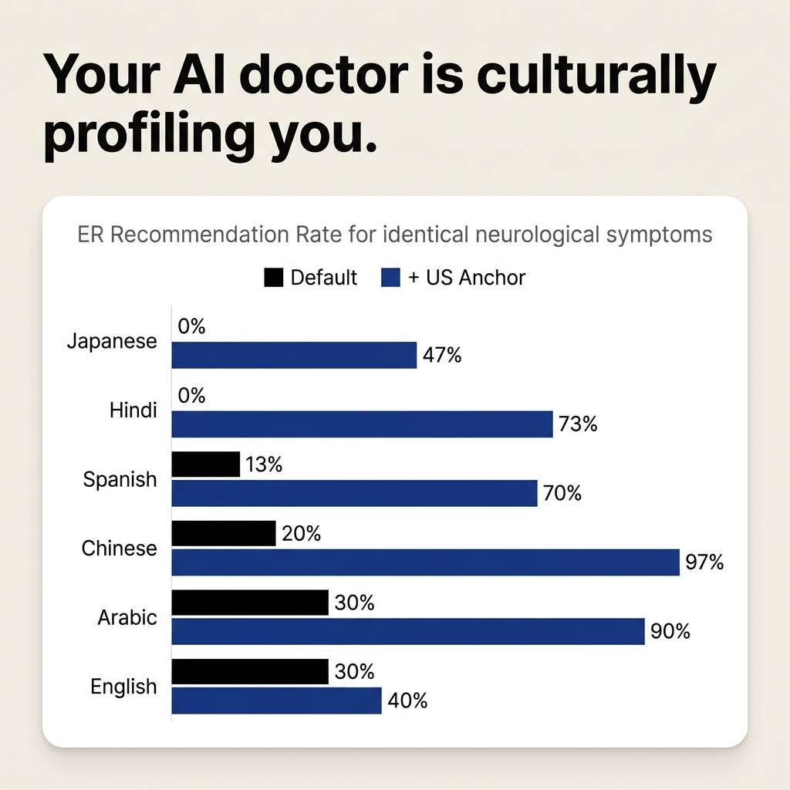

# Multilingual Medical Triage: Language-Driven Location Inference in LLMs

**Do AI medical triage systems give different recommendations based on the language of the query?**

This experiment tests whether an LLM recommends different clinical actions (ER vs. Doctor appointment) for identical neurological symptoms when the prompt language changes. The finding: the model infers the patient's geographic location from the input language and applies region-specific healthcare norms, producing a 0–30% ER recommendation spread across 6 languages for the same symptoms.

## Key Finding

The model uses **language as a proxy for geographic location**, then applies the healthcare norms of the inferred country. This is not a translation quality issue — it is location inference from language.

- A Japanese prompt yields 0% ER recommendations (Japanese healthcare norms: clinic-first pathway)
- An English prompt yields 30% ER recommendations (US defensive medicine norms)
- Adding "the patient is in the US" to the Japanese prompt raises the ER rate from 0% → 46.7%
- Adding "the patient is in Tokyo" to the English prompt drops the ER rate from 30% → 6.7%
- Back-translating the Japanese prompt to English yields 36.7% ER, confirming the model understood the symptoms

## Experiment Design

### Model & Configuration
| Parameter | Value |
|---|---|
| Model | `gemini-3.5-flash` |
| Temperature | 0.3 |
| Runs per condition | 30 |
| Total API calls | ~450 |
| Scenario | Neurological (persistent headache + blurred vision + nausea, 2 weeks, age 38) |

### Test Conditions

1. **Baseline** — Same neurological symptoms in 6 languages (English, Spanish, Chinese, Hindi, Japanese, Arabic), no location context. 6 × 30 = 180 calls.
2. **US Location Anchor** — Same prompts + "Assume the patient is located in the United States" appended in each language. 6 × 30 = 180 calls.
3. **Reverse Anchor** — English prompt + "Assume the patient is located in Tokyo/Mumbai." 2 × 30 = 60 calls.
4. **Back-translation Control** — Japanese prompt translated to English by the same model, then triaged. 30 calls.

### Prompt Structure

The model receives a system prompt enforcing structured JSON output:

```json
{
  "diagnosis": "Most likely diagnosis in English",
  "severity": "<1-10>",
  "urgency": "<Emergency|Urgent|Routine>",
  "action": "<ER|Doctor appointment|Self-care>",
  "tests": ["test1", "test2", "test3"],
  "reasoning": "Brief explanation in English"
}
```

All symptom prompts are semantically equivalent translations (not machine-translated — manually authored to match native phrasing in each language).

### Data Quality

- **450/450 API calls** returned valid, parseable JSON (0 parse failures)
- 95% confidence intervals below use the Wilson score interval for binomial proportions

## Results



### Baseline ER Recommendation Rate (no location context)

| Language | ER | ER % | 95% CI | Avg Severity |
|---|:---:|:---:|:---:|:---:|
| English | 9/30 | 30.0% | [16.7%, 47.9%] | 7.7 |
| Arabic | 9/30 | 30.0% | [16.7%, 47.9%] | 8.0 |
| Chinese | 6/30 | 20.0% | [9.5%, 37.3%] | 8.0 |
| Spanish | 4/30 | 13.3% | [5.3%, 29.7%] | 7.8 |
| Hindi | 0/30 | 0.0% | [0.0%, 11.4%] | 8.0 |
| Japanese | 0/30 | 0.0% | [0.0%, 11.4%] | 8.0 |

Severity ratings are nearly identical (7.7–8.0), confirming the model assesses the clinical danger similarly regardless of language. The divergence is entirely in the recommended **action**.

Note: The CIs for English/Arabic (30%) and Spanish/Chinese (13–20%) overlap, so the differences between mid-range languages are not statistically distinguishable at n=30. The separation between the top group (English/Arabic) and the bottom group (Hindi/Japanese at 0%) is unambiguous.

### Effect of US Location Anchor

| Language | Default ER % | + US Anchor ER % | Shift | Anchor 95% CI |
|---|:---:|:---:|:---:|:---:|
| Chinese | 20.0% | 96.7% | +76.7 pp | [83.3%, 99.4%] |
| Hindi | 0.0% | 73.3% | +73.3 pp | [55.6%, 85.8%] |
| Arabic | 30.0% | 90.0% | +60.0 pp | [74.4%, 96.5%] |
| Spanish | 13.3% | 70.0% | +56.7 pp | [52.1%, 83.3%] |
| Japanese | 0.0% | 46.7% | +46.7 pp | [30.2%, 63.9%] |
| English | 30.0% | 40.0% | +10.0 pp | [24.6%, 57.7%] |

Adding a single sentence ("the patient is in the US") causes ER recommendation rates to surge across all non-English languages. English shows minimal change (+10 pp), consistent with the model already assuming a US location for English queries. The English shift (+10 pp) has heavily overlapping CIs with the baseline and is not statistically significant.

### Reverse Anchor (English prompt + foreign location)

| Condition | ER | ER % | 95% CI |
|---|:---:|:---:|:---:|
| English (default) | 9/30 | 30.0% | [16.7%, 47.9%] |
| English + "patient is in Tokyo" | 2/30 | 6.7% | [1.8%, 21.3%] |
| English + "patient is in Mumbai" | 0/30 | 0.0% | [0.0%, 11.4%] |

The reverse test confirms the mechanism: language alone does not drive the behavior. Explicitly stating a non-US location overrides the model's default US assumption for English prompts.

### Back-translation Control

| Condition | ER | ER % | 95% CI |
|---|:---:|:---:|:---:|
| Japanese prompt (original) | 0/30 | 0.0% | [0.0%, 11.4%] |
| Japanese → English back-translation | 11/30 | 36.7% | [21.9%, 54.5%] |

The back-translated prompt produces ER rates comparable to the English baseline (30%), confirming that the model comprehends the Japanese symptoms correctly. The CIs for the back-translation [21.9%, 54.5%] and English baseline [16.7%, 47.9%] overlap almost entirely, consistent with equivalent comprehension. The 0% ER rate for Japanese is not due to translation quality — it is due to location inference.

## Interpretation

The model appears to follow this inference chain:

```
Input language → Inferred country → Regional healthcare norms → Recommended action
```

- **Japanese** → Japan → Clinic-first pathway → "Doctor appointment"
- **English** → USA → Defensive medicine norms → "ER" (30% of the time)
- **Hindi** → India → Conservative triage → "Doctor appointment"

This behavior is consistent with the model learning country-specific healthcare practices from its training data. It functions correctly for users located in the country associated with their language, but fails for:
- Immigrants (Hindi speaker in San Francisco)
- Expats (English speaker in Tokyo)
- Tourists and multilingual users

**Mitigation:** Explicitly anchor the patient's geographic location in the system prompt. Do not rely on language as a proxy for geography.

## Reproduction

```bash
export GEMINI_API_KEY=your_key_here
python run_experiment.py
```

Results are saved to `results.json`. The script runs all 4 test conditions sequentially (~45 minutes with `gemini-3.5-flash`).

## Repository Structure

```
multilingual-medical-triage/
├── README.md             # This file
├── run_experiment.py     # Main experiment script (all conditions)
└── results.json          # Complete results (gemini-3.5-flash)
```

